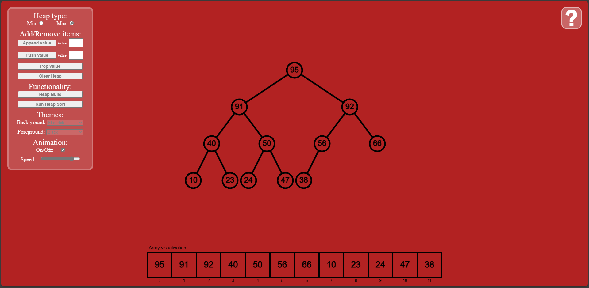

# Heaps-Heapsort

### Description

This project is a website for visualising the data structures heaps, how they work and the heapsort algorithm. It allows the user to view both the more intuitive node implementation and the more efficient array implementation and see the various heap operations (push, pop...) animated.

### Screenshots

  
  &nbsp; &nbsp; &nbsp; &nbsp;
  

  
  &nbsp; &nbsp; &nbsp; &nbsp;
  

(*full size images can be found [here](./screenshots)*)

### What was learnt

This project was done as a way to explore web development with JavaScript, HTML and CSS as these were things I had not done previously. This was also a way to better understand heaps and the heapsort algorithm.

### Application instructions

Instructions and information about heaps can be found while running the application by clicking the '?' in the top right of the page (shown in the screenshot above). At the top left of the page is the controls panel. The following (in order) shows what each element does:

- **Min/max heap selector** - This changes the way data is organised (smallest value at the top for a min heap and largest for a max heap). If animation is turned on while the heap type is altered the heap building process will be animated as the heap is reorganised.

- **Append value** - This adds a value to the heap/array without reorganising the values to keep it as a valid heap, allowing for the heap building operation to be animated. Using the adjacent text box, a user specified value, or set of values (comma separated), can be added.

- **Push value** - This adds a value to the heap/array then reorganises the values so it remains a valid heap, with animation turned on this will be animated for the user. Using the adjacent text box, a user specified value, or set of values (comma separated), can be added.

- **Pop value** - This removes the top (largest for max heap, smallest for min heap) value from the heap. The last element of the heap is promoted in its place then the values are then reorganised so it remains a valid heap, with animation turned on this will be animated for the user.

- **Clear heap** - This clears the heap/array of all values, allowing new or desired values to be added to the heap.

- **Heap build** - Loops through each parent node starting with the last ensuring each sub tree is a valid heap until it gets to the top and all the heap is made valid. The heap build function runs in linear time (O(N)). This will be animated if animation is turned on.

- **Run Heap sort** - This uses pop() to repeatedly remove the top element from the heap then appends the value to the end of the array resulting in a sorted list of values with linearithmic or loglinear (O(N log N)) time complexity. A min heap will result in values sorted in descending order whereas a max heap will result in values sorted in ascending order. (The validity of the heap will be checked without animation prior to sorting so running the heap build function is recommended if it is desired to see that part).

- **Background colour list** - Allows the alteration of the background colour.

- **Foreground colour list** - Allows the alteration of the text and line colour.

- **Animation switch** - Turns animations on or off (can be altered during execution to speed up tasks that do not need to be seen).

- **Animation speed slider** - Alters the animation speed (can be altered during execution to speed up or slow down the animations).

### How to use

The website can be run either by cloning the repository and running the 'index.html' file in a web browser (to run the website locally) or by opening the website via GitHub [here](https://luke663.github.io/Heaps-Heapsort/).

### License
This is a demonstration project and not intended for collaboration, as such a license has not been added meaning the default copyright laws apply and no one may reproduce, distribute, or create derivative works from this work.
